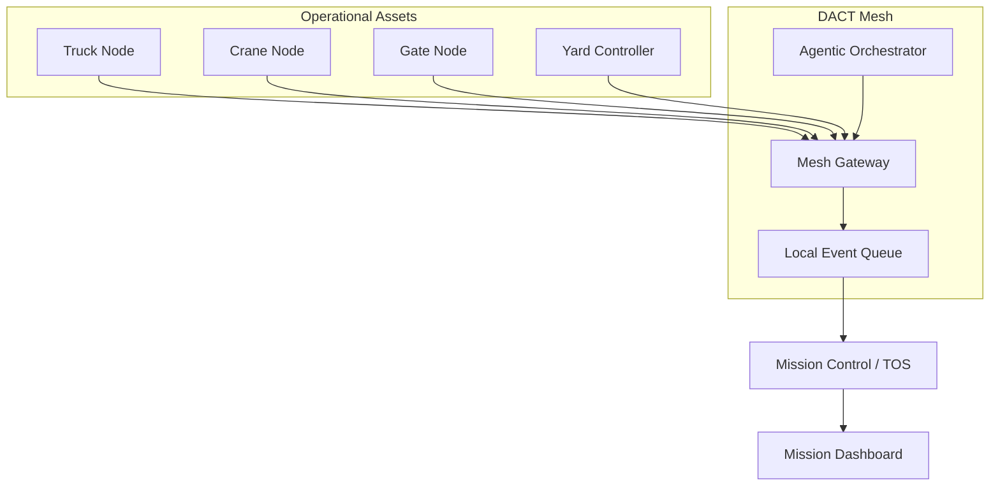
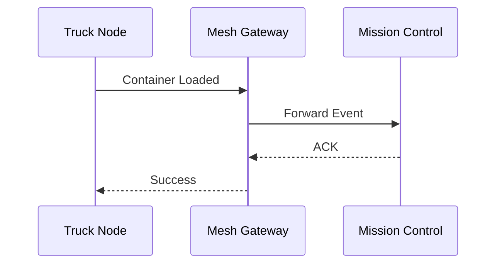
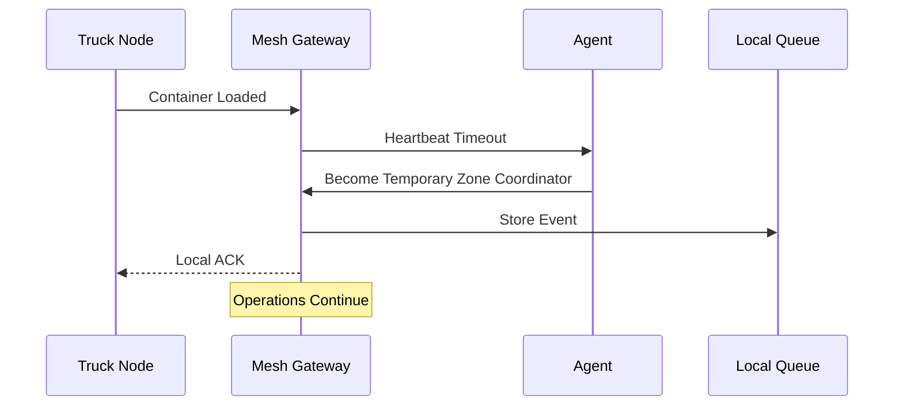
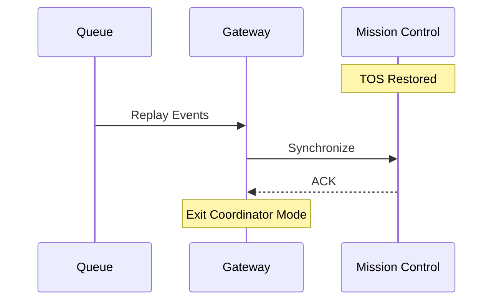

<div align="center">

# 🚢 DACT
### Decentralized Autonomous Container Tracking

### The Operational Continuity Layer for Modern Container Terminals


---

### "Cybersecurity attempts to prevent attacks. DACT assumes attacks can still succeed—and ensures terminal operations continue."

</div>

---

# 📌 Problem Statement

Ports rely on centralized **Terminal Operating Systems (TOS)** to coordinate container movement.

However,

- Massive stacks of steel containers create communication dead zones.
- Operational assets lose connectivity with the central registry.
- Traditional offline database synchronization introduces delays.
- Cargo movement slows or completely stops during connectivity failures.

The challenge is to build a **decentralized peer-to-peer system** that allows local equipment to continue coordinating **without depending on the central TOS.**

---

# 🎯 Our Objective

DACT was built specifically to solve **Problem Statement 3 – Decentralized Port Logistics**.

Instead of waiting for connectivity to return,

DACT enables operational assets to coordinate directly through a decentralized mesh network while maintaining consistent container tracking across terminal zones.

---

# ✅ How DACT Addresses Every Constraint

| Problem Statement Requirement | DACT Solution |
|------------------------------|---------------|
| Avoid offline database replication | ✅ Event-driven peer coordination instead of offline-first sync |
| Local nodes communicate peer-to-peer | ✅ Mesh communication between operational assets |
| Network isolation | ✅ Temporary Zone Coordinator keeps operations running locally |
| High-density operations | ✅ Zone-based architecture supporting thousands of simultaneous events |
| Continuous operations | ✅ Local event queue with automatic synchronization after recovery |

---

# 🚨 Existing Architecture

```text
Truck
     │
Crane
     │
RFID
     │
Gate
     │
──────────────
Terminal Operating System
──────────────
```

Every operational event depends on the central TOS.

If the TOS becomes unavailable,

operations stop.

---

# 🚀 DACT Architecture



---

# ⚙ Normal Operation



---

# 🚨 During TOS Failure



---

# 🔄 Recovery



---

# 🤖 Why Agentic AI?

Container tracking itself remains **deterministic**.

The AI agent is responsible only for operational orchestration.

Responsibilities include:

- Gateway health monitoring
- Temporary Coordinator supervision
- Queue prioritization
- Failure diagnosis
- Recovery orchestration
- Mesh health monitoring
- Predictive congestion analysis

If the AI layer fails,

the deterministic tracking system continues operating.

---

# 🏗 System Workflow

```text
RFID Scan

↓

Container Assigned

↓

Truck Node

↓

Peer-to-Peer Mesh

↓

Mesh Gateway

↓

Mission Control

↓

Dashboard Update
```

---

## During Failure

```text
Truck Node

↓

Peer-to-Peer Mesh

↓

Temporary Zone Coordinator

↓

Local Event Queue

↓

Operations Continue

↓

Mission Control Restored

↓

Automatic Synchronization
```

---

# 🖥 Demo Architecture

The live demonstration uses three systems.

```text
                  DANISH
      Mission Control Dashboard

                 ▲

          HTTPS / Socket.IO

                 ▲

────────────────────────────────────────

                 MONIKA

Mesh Gateway + Agent Layer

Internet Connected

                 ▲

Peer-to-Peer Communication

                 ▲

────────────────────────────────────────

                 SARTAJ

Offline Edge Node

Hardware Simulation

RFID Events
```

---

# 🎬 Demo Story

```text
Truck Enters

↓

RFID Scan

↓

Container Loaded

↓

Gateway Forwards Event

↓

Dashboard Updates

↓

TOS Failure

↓

Gateway Detects Failure

↓

Temporary Coordinator Activated

↓

Operations Continue

↓

Queue Stores Events

↓

TOS Restored

↓

Queue Synchronizes

↓

Normal Operations
```

---

# 💻 Technology Stack

## Frontend

- React
- TypeScript
- Tailwind CSS
- Lovable

## Backend

- Node.js
- Express
- Socket.IO

## AI

- AWS Strands SDK
- Local Lightweight SLM

## Hardware

- Raspberry Pi 5
- ESP32
- RFID Readers

## Communication

Current MVP

- Socket.IO Peer Network

Future

- Wi-Fi HaLow
- BLE Mesh
- LoRa

---

# 📈 Deployment Feasibility

Medium Container Terminal

| Metric | Value |
|----------|--------|
| Edge Nodes | 100 |
| Gateway Nodes | 5 |
| Deployment Time | ~7 Weeks |
| Initial Deployment | ₹1.3 Crore |
| Annual Support | ₹40 Lakh |

> These figures are engineering estimates for a medium-sized terminal deployment.

---

# 💰 Infrastructure Protected

A medium-sized terminal typically operates approximately

# **₹1,200 Crore**

worth of operational assets.

| Asset | Approximate Value |
|--------|------------------|
| Ship-to-Shore Cranes | ₹640–960 Cr |
| RTG Cranes | ₹240–360 Cr |
| Terminal Trucks | ₹18–30 Cr |
| Reach Stackers | ₹32–48 Cr |
| Empty Container Handlers | ₹15–25 Cr |
| Forklifts | ₹4–10 Cr |

---

# 📊 Investment Perspective

Deployment Cost

## ₹1.3 Crore

Assets Protected

## ₹1,200 Crore

**≈ 0.1% of protected operational infrastructure**

The deployment cost is also approximately **1–2% of the cost of a single modern Ship-to-Shore Crane.**

---

# 🎯 Value Proposition

| Traditional TOS | DACT |
|-----------------|------|
| Centralized | Decentralized |
| Stops when unavailable | Operations continue locally |
| Requires connectivity | Peer-to-peer mesh |
| Manual recovery | Automatic synchronization |
| Single point of failure | Distributed coordination |

---

# 📦 Business Model

### Customers

- Port Authorities
- Terminal Operators
- Logistics Parks
- Container Freight Stations

### Revenue

- Enterprise Deployment
- Annual Software License
- Professional Services
- Support & Maintenance

---

# 🛣 Roadmap

```text
Hackathon MVP

↓

Pilot Deployment

↓

Commercial Terminal

↓

Multi-Terminal Deployment

↓

National Port Infrastructure
```

---

# 🌍 Vision

DACT is not another Terminal Operating System.

DACT is an **Operational Continuity Platform** designed to keep ports moving during infrastructure failures.

Instead of replacing existing systems,

DACT augments them with decentralized coordination and intelligent recovery.

---

# 👨‍💻 Team

Built for **SEBI TechSprint / Hackathon** with a vision to redefine resilient logistics infrastructure.

---

<div align="center">

### ⭐ If you found DACT interesting, consider giving this repository a star!

**Building the Future of Decentralized Port Operations 🚢**

</div>
